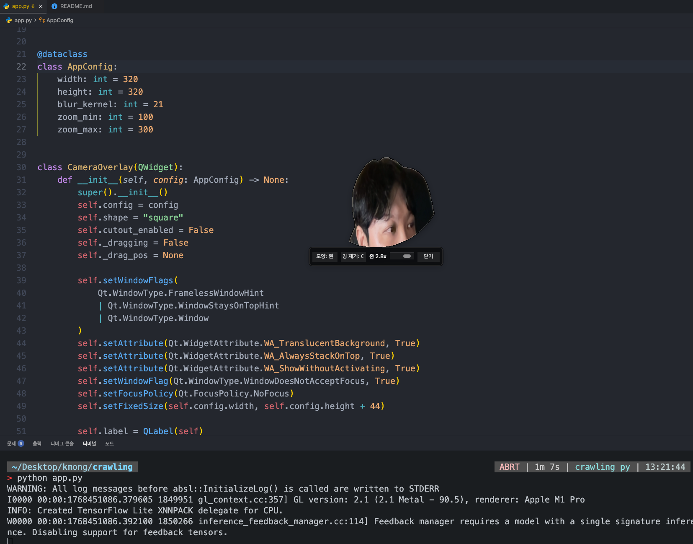
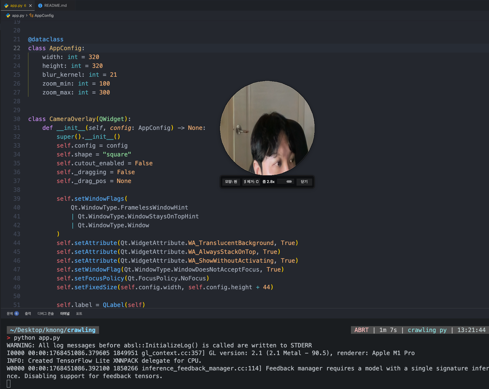
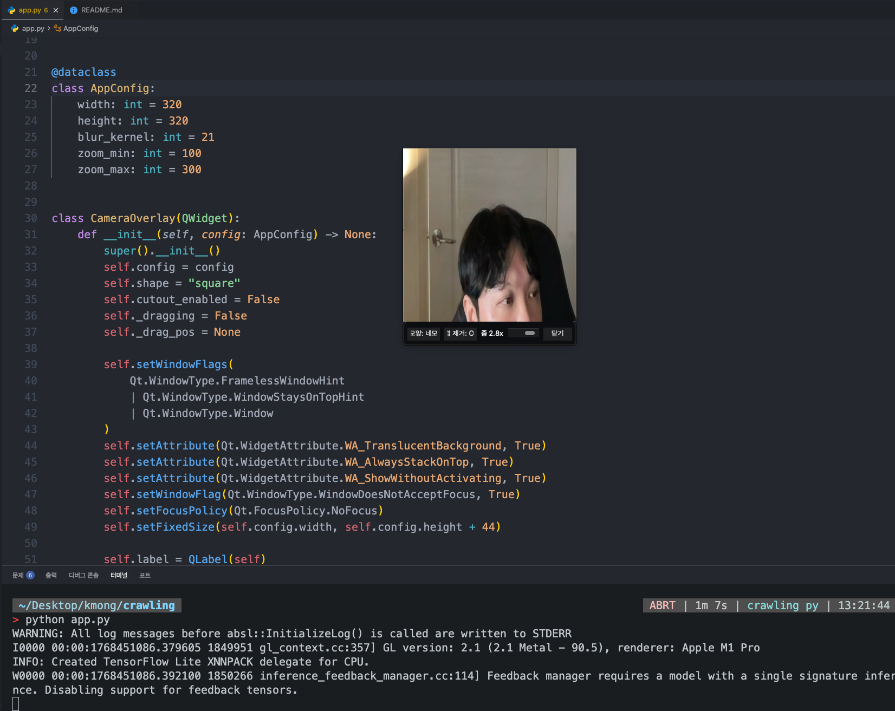

# 카메라 오버레이 앱 (macOS)

온라인 강의용으로 항상 화면 위에 떠 있는 카메라 창을 띄우는 간단한 앱입니다.

## 실행 화면




## 기능
- 항상 위에 떠 있는 카메라 오버레이
- 네모/원형 모양 전환
- 사람만 보이고 배경은 투명(마스킹) 처리
- 마우스 드래그로 위치 이동
- 버튼 클릭으로 제어

## 실행 방법 (uv)
```bash
uv venv .venv
source .venv/bin/activate
uv sync
uv run python app.py
```

최초 실행 시 macOS에서 카메라 권한을 요청합니다. 허용해 주세요.
`requirements.txt`는 기존 방식 호환용이며, uv 사용을 권장합니다.

## 실행 파일 만들기
```bash
chmod +x scripts/build.sh
scripts/build.sh
```

빌드 완료 후 `dist/CameraOverlay.app`가 생성됩니다.
카메라 권한이 필요하므로 빌드용 Info.plist에 `NSCameraUsageDescription`을 포함했습니다.

## 아이콘 설정
`assets/icon.icns` 파일을 준비한 뒤 `scripts/build.sh`를 실행하면 앱 아이콘이 적용됩니다.
아이콘은 `.icns` 형식이어야 합니다.

## 조작 방법
- `모양` 버튼: 네모/원형 전환
- `배경 제거` 버튼: 사람만 남기기 토글
- `줌` 조절 바: 화면 확대(줌 인)로 화각 조절
- `닫기` 버튼: 종료

## 참고
- 원형 모드에서는 윈도우 자체가 원형 마스크로 잘립니다.
- 배경 제거는 간단한 인물 분할(Selfie Segmentation) 기반입니다.
